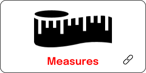

# Critical Hygiene Framework

Sample

<div class="row">
  <div class="column"></div>
  <div class="column"></div>
  <div class="column"></div>
</div>

|<a href="assist/"></a>| <a href="other/"></a> |  | 
| :---:  | :---: | :---: |
||||

<details>
  <summary><h2>Availability</h2></summary>
  <p></p>
  Some text here
  
  ### Heading
  1. Foo
  2. Bar
     * Baz
     * Qux

  ### Some Javascript
  ```js
  function logSomething(something) {
    console.log('Something', something);
  }
  ```
</details>

Sample
